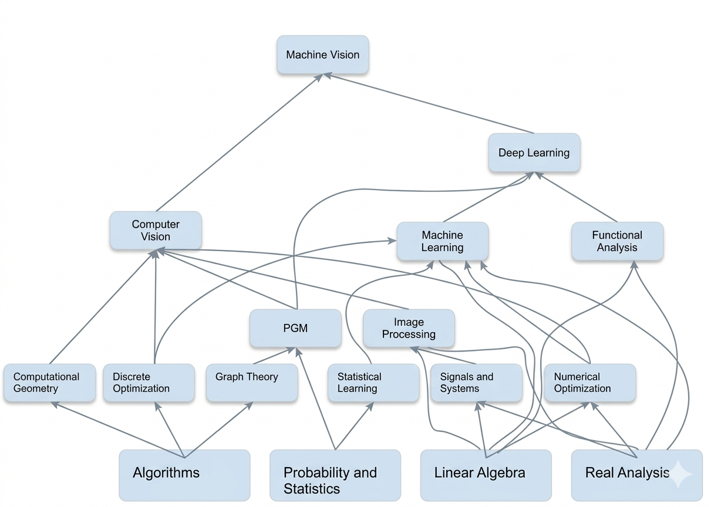

# Maths and Fundamentals for Artificial Intelligence

A structured repository for studying the mathematical, computational, and machine learning foundations of AI. The layout follows the dependency map from the research report and the subject list shown in the books screenshot.

## Subject Graph

## Repository Structure

- `assets/` - graphs, diagrams, and supporting visuals
- `areas/` - domain and subject documentation
- `data/` - future metadata, curriculum exports, and source tables
- `books/` - local-only PDF library mirror, ignored by git

## Domain Index

- [Core Math](areas/core-math/README.md)
- [Core CS](areas/core-cs/README.md)
- [Core Optimization and Signals](areas/core-optimization-signals/README.md)
- [Core ML](areas/core-ml/README.md)
- [Vision Stack](areas/vision-stack/README.md)

## Covered Areas

| Domain | Areas |
| --- | --- |
| Core Math | Linear Algebra, Probability and Statistics, Real Analysis, Functional Analysis, Graph Theory |
| Core CS | Algorithms, Computational Geometry, Discrete Optimization |
| Core Optimization and Signals | Numerical Optimization, Signals and Systems |
| Core ML | Statistical Learning, Machine Learning, PGM, Deep Learning |
| Vision Stack | Image Processing, Computer Vision, Machine Vision |

## Notes

- Subject pages live under `areas/<domain>/<area>/README.md`.
- The local books library mirrors the same taxonomy under `books/`.
- Contribution guidelines live in [CONTRIBUTING.md](CONTRIBUTING.md).
